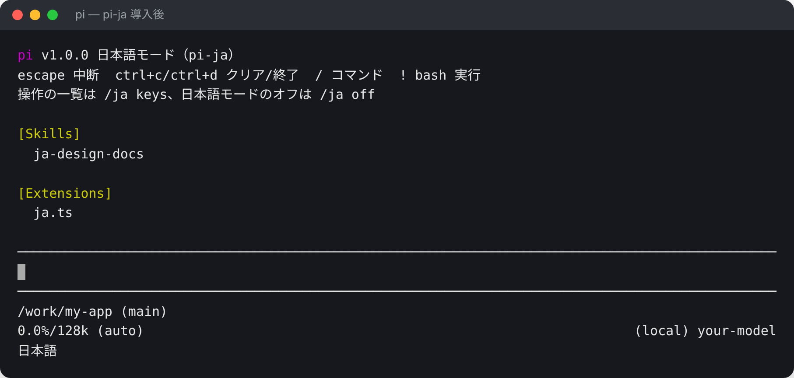
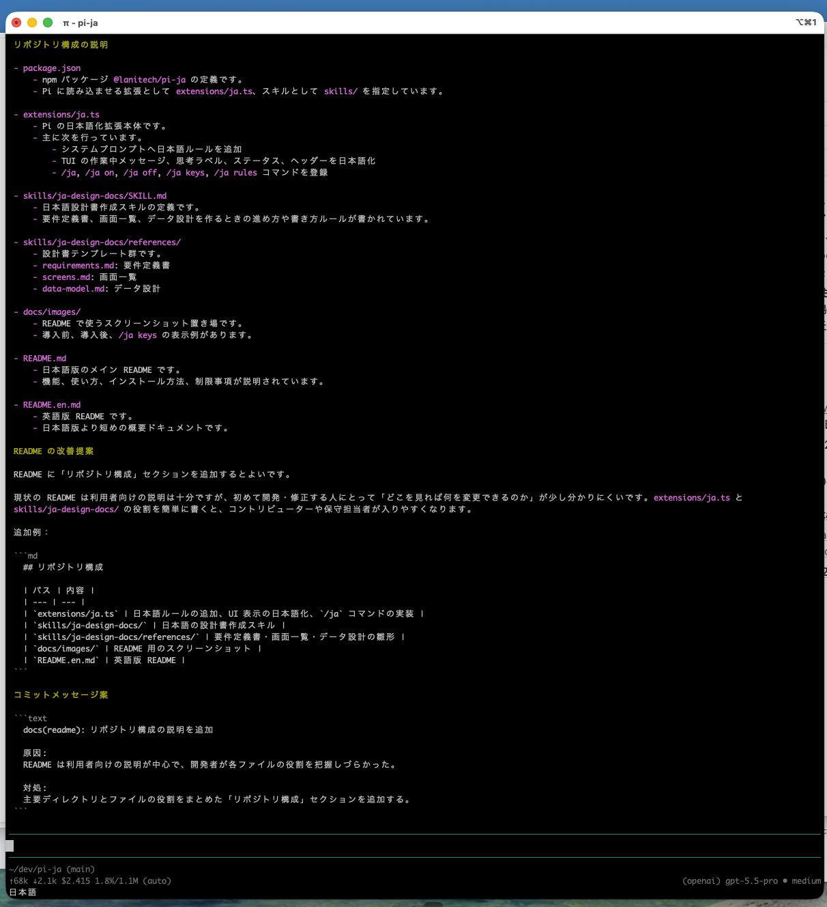
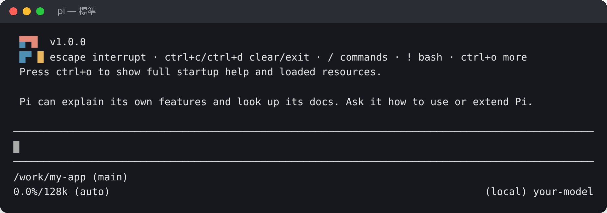
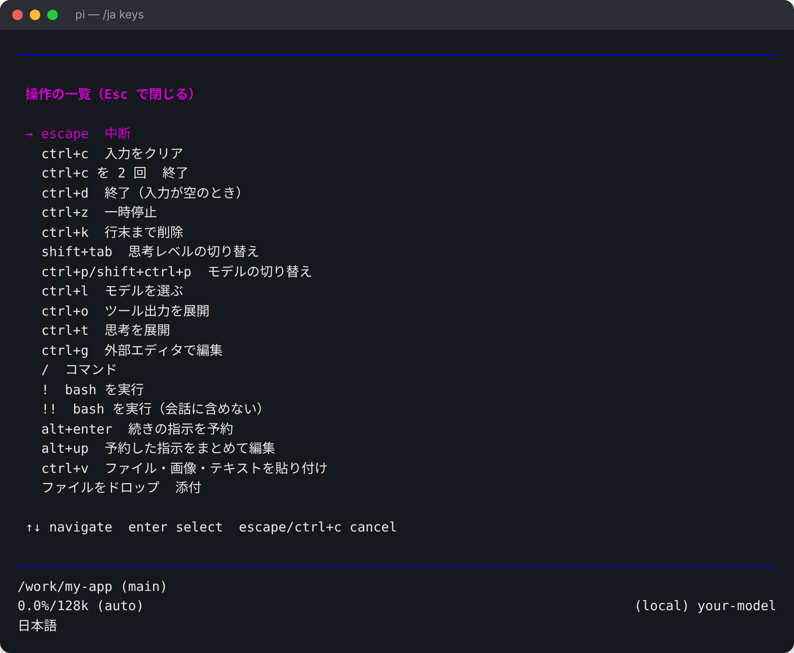
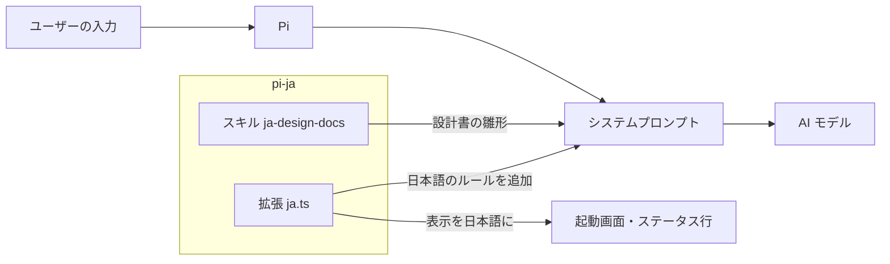

# pi-ja

**コーディングエージェント Pi を、日本語で使うためのパッケージです。**

[Pi](https://pi.dev) はオープンソース（MIT）のコーディングエージェントです。pi-ja を入れると、AI の応答・コードのコメント・コミットメッセージ・設計書が日本語になり、画面の表示も日本語になります。

[](https://www.npmjs.com/package/@lanitech/pi-ja)


[English](README.en.md)

```bash
pi install npm:@lanitech/pi-ja
```



---

## pi-ja でできること

| | 機能 | 内容 |
| --- | --- | --- |
| 1 | 日本語で作業するルール | 応答・コメント・コミットメッセージ・ドキュメントを日本語で書くルールを、システムプロンプトに追加します |
| 2 | 画面表示の日本語化 | 起動画面、操作のヒント、作業中の表示、操作の一覧を日本語で表示します |
| 3 | 日本語の設計書スキル | 要件定義書・画面一覧・データ設計を、日本語の雛形に沿って作ります |

入れたあとは Pi を起動するだけで使えます。設定は要りません。

---

## 1. 日本語で作業するルール

Pi が AI に渡すシステムプロンプトに、日本語で作業するためのルールを 1 つのセクションとして追加します。

| 対象 | ルール |
| --- | --- |
| 応答 | 日本語の「です・ます」調で書く。前置きや定型の謝罪は省き、結論から書く |
| 原文のまま残すもの | 関数名・ファイルパス・コマンド・エラーメッセージ・ログは訳さない |
| コード | 識別子は英語。新しく書くコメントは日本語で、「なぜそうしたか」を書く。既存ファイルのコメントが英語なら英語に合わせる |
| コミットメッセージ | リポジトリに規約があればそれに従う。なければ `fix(auth): ログイン後にリダイレクトされない問題を修正` の形にする |
| ドキュメント | 設計書・README は日本語。日付は YYYY-MM-DD、英数字は半角 |

**既存のプロジェクトの規約は上書きしません。** プロジェクトの `AGENTS.md` / `CLAUDE.md` や、ユーザーが指示した内容と違う場合は、そちらを優先するようにしています。英語で話しかけた場合は英語で返します。

追加しているルールの全文は `/ja rules` で確認できます。

### 実際の応答の例

「このリポジトリの構成を説明して。そのうえで README の改善を1つ提案し、その変更のコミットメッセージ案も書いて」と頼んだときの応答です。説明は「です・ます」調の日本語で、ファイル名はそのまま、コミットメッセージは `docs(readme): 〜` の形で返ってきます。



---

## 2. 画面表示の日本語化

起動画面の操作ヒント、作業中の表示（「作業中（escape で中断）」）、思考ラベル、ステータス行を日本語にします。

**導入前**



**導入後**


画面左下に「日本語」と出ていれば、日本語モードで動いています。

### 操作の一覧を日本語で見る

`/ja keys` で、キー操作の一覧を日本語で表示します。キーの割り当てを変えている場合も、自分の設定どおりに表示されます。



---

## 3. 日本語の設計書スキル（ja-design-docs）

開発前の設計書を、日本語の雛形に沿って作るスキルです。

| 文書 | 主な項目 | 出力先 |
| --- | --- | --- |
| 要件定義書 | 背景と目的、対象範囲、利用者、業務の流れ、機能要件、非機能要件、外部連携、確認事項 | `docs/requirements.md` |
| 画面一覧 | 画面 ID と URL、画面遷移図、画面ごとの入力項目・操作・エラー文言 | `docs/screens.md` |
| データ設計 | ER 図、テーブル一覧、テーブル定義、コード値、データの保持期間 | `docs/data-model.md` |

作り方のルールもスキルに入れています。

- すでに設計書があれば、新しく作らずにその文書を更新する
- コードやスキーマから分かることは先に埋め、推測では埋めない
- 分からない項目は「未定：〇〇を確認」と書き、最後にまとめて質問する
- 要件 ID（`REQ-01`）・画面 ID（`SCR-01`）・テーブル名を 3 つの文書でそろえる
- 図は Mermaid で書く（GitHub でそのまま表示されます）

使い方は、そのまま頼むか、スキル名を指定して呼び出します。

```text
予約管理システムの要件定義書を作って
```

```text
/skill:ja-design-docs 既存のコードから画面一覧を作って
```

---

## しくみ

pi-ja は Pi の拡張（extension）とスキル（skill）を 1 つにまとめたパッケージです。Pi 本体には手を入れていません。



- ルールは、システムプロンプトのセクションを 1 つ足す形で入れています。プロンプト全体を書き換えないので、ほかの拡張と一緒に使えます。
- `/ja off` にするとルールが外れ、画面表示も Pi の標準に戻ります。この設定はセッションに保存されます。

---

## インストール

[Pi](https://pi.dev) 1.0 以降が必要です。

```bash
pi install npm:@lanitech/pi-ja
```

プロジェクトだけに入れる場合は `-l` を付けます。

```bash
pi install -l npm:@lanitech/pi-ja
```

外すときは次のコマンドです。

```bash
pi remove npm:@lanitech/pi-ja
```

## コマンド

スラッシュコマンドは英語のままにしています。

| コマンド | 内容 |
| --- | --- |
| `/ja` | 今の状態を表示 |
| `/ja on` / `/ja off` | 日本語モードの切り替え（セッションに保存） |
| `/ja keys` | 操作の一覧を日本語で表示 |
| `/ja rules` | システムプロンプトに追加しているルールを表示 |

## 日本語にならないところ

Pi 本体のメニュー、`/` コマンドの説明文、設定画面の文言は英語のままです。Pi の拡張の仕組みでは、これらを置き換えられないためです。

---

## ライセンス

MIT

## 作者

[lanitech合同会社](https://lanitech.jp)

AI駆動開発の進め方をまとめた [AI駆動開発 実践ガイド](https://ai.lanitech.jp/ai-driven-development-guide/) も公開しています。
