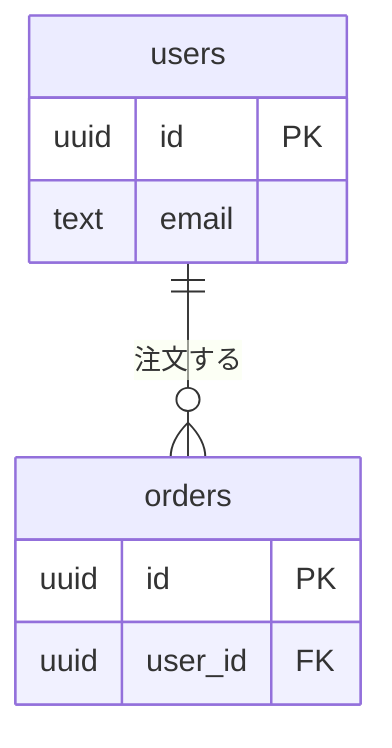

# データ設計：{システム名}

| 項目 | 内容 |
| --- | --- |
| 文書の版 | 0.1 |
| 作成日 | YYYY-MM-DD |
| データベース | 例：PostgreSQL |
| 関連文書 | 要件定義書（docs/requirements.md）、画面一覧（docs/screens.md） |

## 1. ER 図

## 2. テーブル一覧

| テーブル名 | 論理名 | 概要 | 主な利用画面 |
| --- | --- | --- | --- |
| users | ユーザー | | SCR-01 |

## 3. テーブル定義

### users（ユーザー）

| カラム名 | 論理名 | 型 | NULL | 既定値 | 説明 |
| --- | --- | --- | --- | --- | --- |
| id | ID | uuid | 不可 | gen_random_uuid() | 主キー |
| email | メールアドレス | text | 不可 | | 一意 |
| created_at | 作成日時 | timestamptz | 不可 | now() | |
| updated_at | 更新日時 | timestamptz | 不可 | now() | |

- 主キー：id
- 一意制約：email
- インデックス：
- 外部キー：
- アクセス権限：誰が読めて、誰が書けるか（行レベルの制御があれば書く）

## 4. コード値

| 区分 | 値 | 意味 |
| --- | --- | --- |
| orders.status | pending | 受付 |

## 5. データの保持と削除

| 対象 | 保持期間 | 削除の方法 |
| --- | --- | --- |
| | | 物理削除 / 論理削除（deleted_at） |

## 6. 確認事項

| No | 内容 | 状態 |
| --- | --- | --- |
| 1 | 未定：〇〇を確認 | 未回答 |
