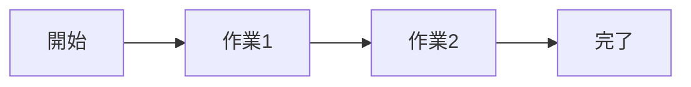

# 要件定義書：{システム名}

| 項目 | 内容 |
| --- | --- |
| 文書の版 | 0.1 |
| 作成日 | YYYY-MM-DD |
| 作成者 | |
| 状態 | 作成中 / レビュー中 / 確定 |

## 1. 背景と目的

- 背景：なぜこのシステムが必要か（今どう困っているか）
- 目的：何ができるようになれば成功か
- 成功の指標：数字で測れるもの（例：受付から返信までの時間を 2 日から当日に）

## 2. 対象範囲

| 区分 | 内容 |
| --- | --- |
| 対象 | 今回作るもの |
| 対象外 | 今回は作らないもの（あとで作るものは「次期」と書く） |

## 3. 利用者

| 利用者 | 説明 | 主な操作 |
| --- | --- | --- |
| 一般ユーザー | | |
| 管理者 | | |

## 4. 業務の流れ

## 5. 機能要件

| ID | 機能 | 内容 | 利用者 | 優先度 | 関連画面 |
| --- | --- | --- | --- | --- | --- |
| REQ-01 | | | | 必須 / 推奨 / 任意 | SCR-01 |

## 6. 非機能要件

| 区分 | 要件 |
| --- | --- |
| 性能 | 例：一覧画面は 2 秒以内に表示 |
| 可用性 | 例：平日 9〜18 時は停止しない |
| セキュリティ | 認証方式、権限、個人情報の扱い |
| 対応環境 | ブラウザ、端末、画面幅 |
| 運用・保守 | バックアップ、ログ、監視 |

## 7. 外部連携

| 連携先 | 方向 | 内容 | 方式 |
| --- | --- | --- | --- |
| | 送信 / 受信 | | API / CSV / Webhook |

## 8. 制約・前提

- 技術の制約（使う言語・フレームワーク・クラウド）
- 予算・期限
- 前提としていること

## 9. 確認事項

| No | 内容 | 確認先 | 状態 |
| --- | --- | --- | --- |
| 1 | 未定：〇〇を確認 | | 未回答 |
