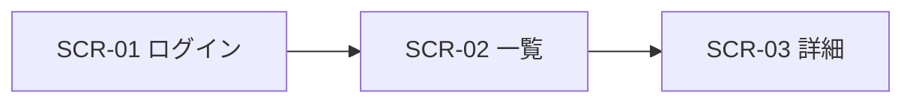

# 画面一覧：{システム名}

| 項目 | 内容 |
| --- | --- |
| 文書の版 | 0.1 |
| 作成日 | YYYY-MM-DD |
| 関連文書 | 要件定義書（docs/requirements.md） |

## 1. 画面一覧

| ID | 画面名 | URL | 利用者 | 概要 | 関連要件 |
| --- | --- | --- | --- | --- | --- |
| SCR-01 | ログイン | /login | 全員 | | REQ-01 |
| SCR-02 | | | | | |

## 2. 画面遷移

## 3. 画面ごとの詳細

### SCR-01 {画面名}

- 目的：この画面で利用者がすること
- 表示条件：誰が、どの状態のときに見られるか

| 項目 | 種類 | 必須 | 入力ルール・表示内容 | データの出どころ |
| --- | --- | --- | --- | --- |
| メールアドレス | テキスト入力 | 必須 | メール形式 | users.email |

| 操作 | 結果 |
| --- | --- |
| 送信ボタン | 成功：SCR-02 へ移動 / 失敗：エラーメッセージを表示 |

| エラー | 表示する文言 |
| --- | --- |
| 入力漏れ | 「〇〇を入力してください」 |

## 4. 共通ルール

- レイアウト（ヘッダー・メニュー・フッター）
- スマートフォン表示の扱い
- 日付・金額の表示形式（例：2026-10-03、1,000 円）
- 空の状態・読み込み中の表示
